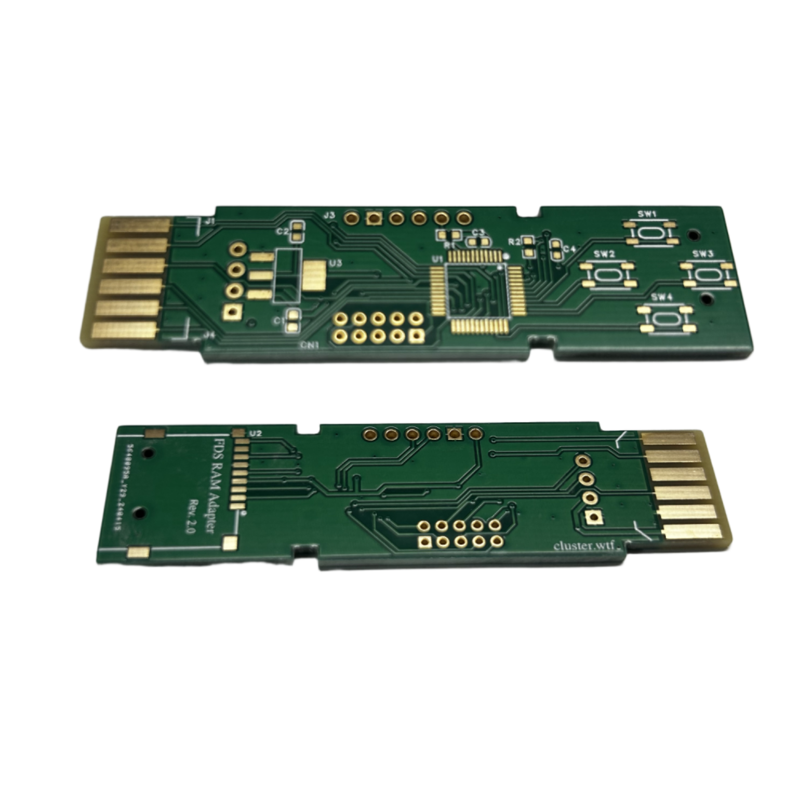
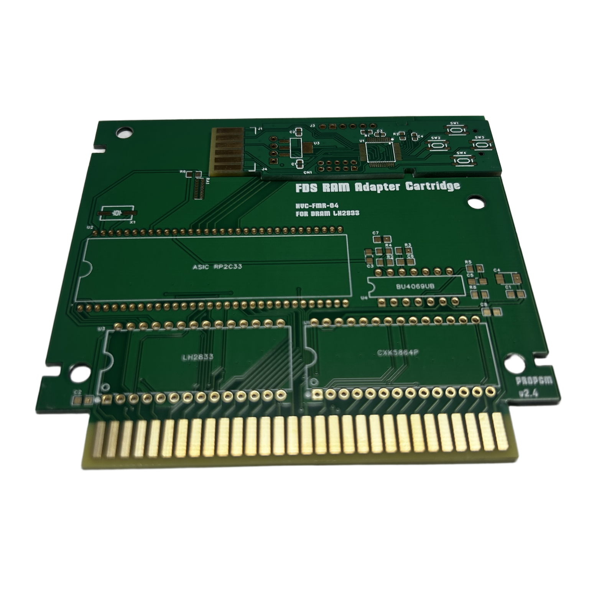

# FDSKey Mod PCB

This is a modified PCB design for the [FDSKey RAM Adapter Cartridge](https://propgm.com/en-gb/product/famicom_fds_cartridge) from PROPGM.

## Overview

The FDSKey RAM Adapter Cartridge is a drive emulator solution designed for Nintendo Famicom and AV Sharp Twin Famicom consoles. This modified PCB is built for use with the FDS RAM Cartridge. It essentially combines the FDSKey and RAM adapter to create a game cartridge.

## Features

- Compatible with the original case
- Adds CN1 connector to connect with the FDS RAM Cartridge  

## PCB Images

### PCB Top View

### Cartridge Face (Not included)

## Technical Details

Please refer to the `bom.md` file for the complete Bill of Materials (BOM).

## License

See [LICENSE](LICENSE) file for details.

